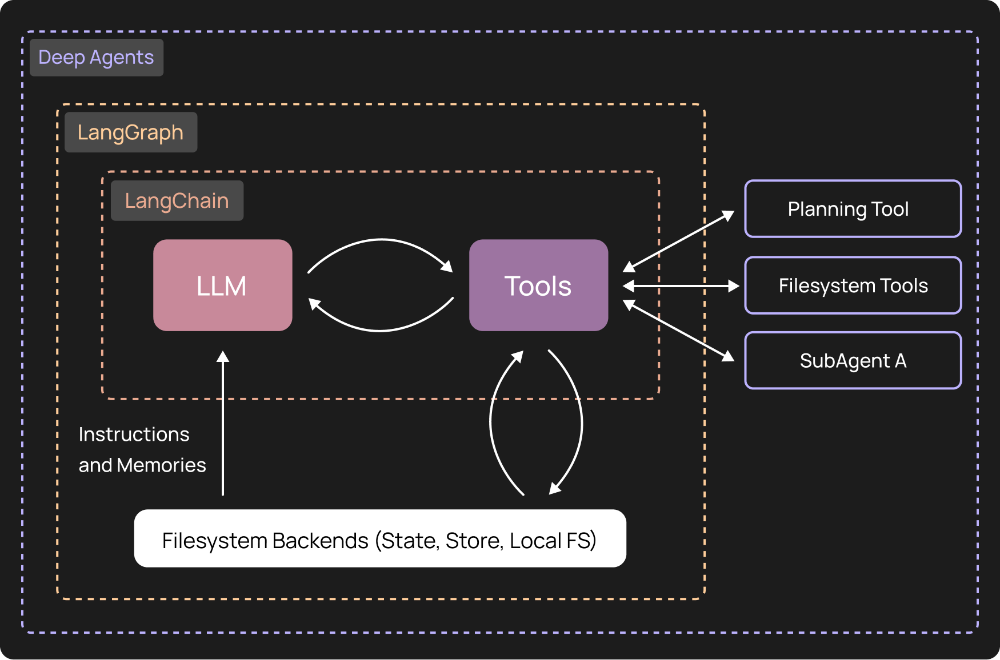
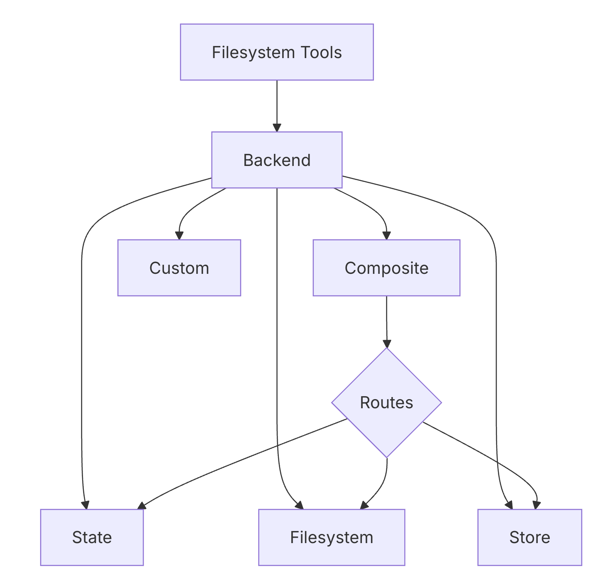
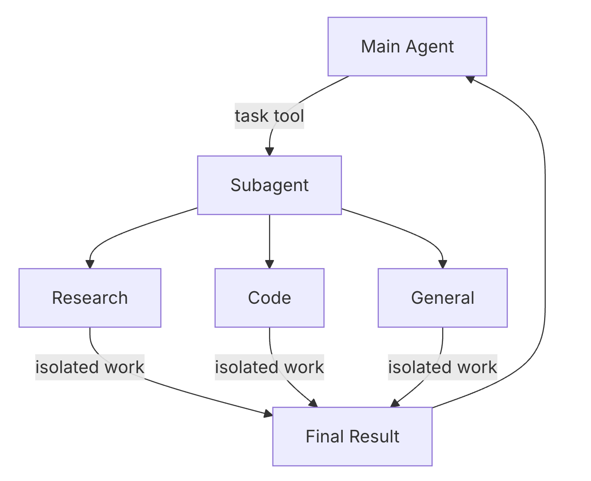
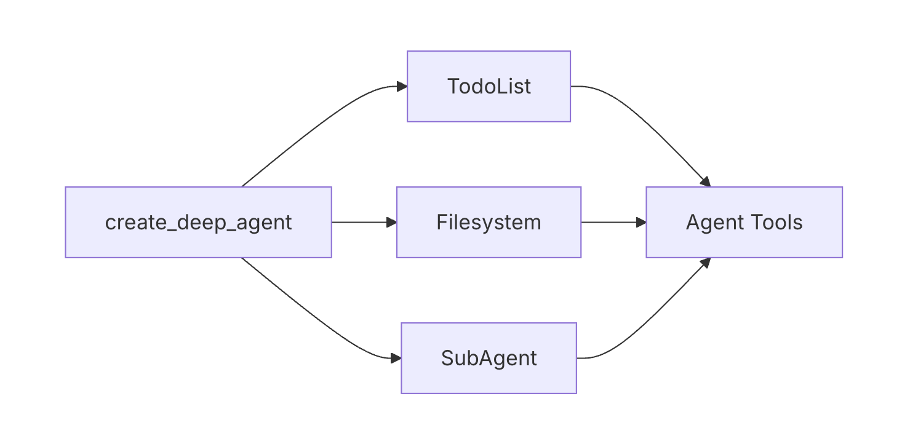
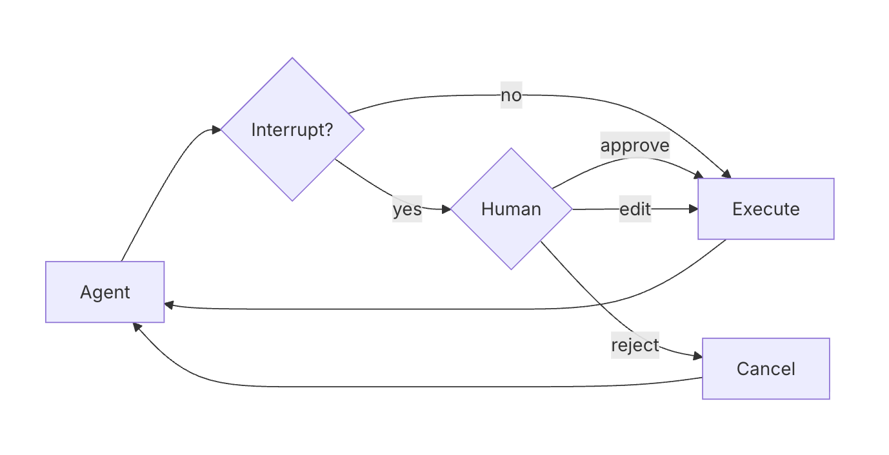
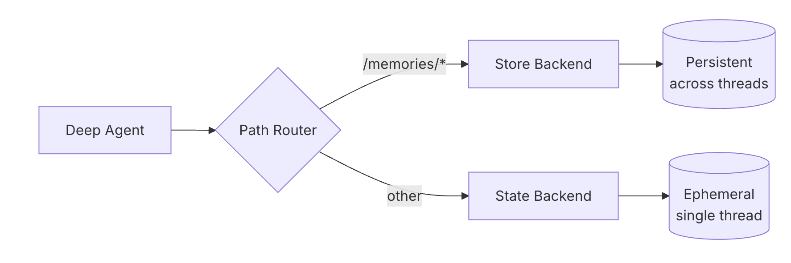

# Workshop: Deep Agents - Building a Research Agent from Scratch

Welcome to the Deep Agents workshop for TypeScript!

## Introduction

This workshop walks through the core concepts of the **Deep Agents** framework using TypeScript / Node.js. Each section introduces a new concept with a standalone agent you can run and experiment with in LangGraph Studio.

**Workshop Format**: This workshop is designed to be run through the `/agents` folder using LangGraph Studio. Each agent builds upon previous concepts, creating a progressive learning experience -- from a basic harness to a fully-featured research agent with tools, memory, skills, and human-in-the-loop.

**What you'll learn:**
- What Deep Agents provides out of the box
- Adding custom tools (Tavily web search)
- Backend types: StateBackend, FilesystemBackend, CompositeBackend, StoreBackend
- Task delegation with subagents and context isolation
- Custom middleware for observability
- Human-in-the-loop patterns for safety
- Long-term memory with namespace scoping
- AGENTS.md identity and Skills for on-demand capabilities

## Pre-work

### 1. Set up your environment
Create a `.env` file with your API keys:
```bash
# Copy the example file and fill in your keys
cp .env.example .env
```
Then add your API keys. You'll need at minimum an `OPENAI_API_KEY` and a `TAVILY_API_KEY`.

If you run into issues acquiring the necessary API keys due to any restrictions (ex. corporate policy), contact your LangChain representative and we'll find a work-around!

### 2. Install dependencies
Ensure you have Node.js (v20+) and pnpm installed:
```bash
# Install pnpm if you haven't already
npm install -g pnpm

# Install all project dependencies
pnpm install
```

### 3. Launch LangGraph Studio

```bash
npx @langchain/langgraph-cli dev --config ./langgraph.json
```

This command will:
- Start the LangGraph API server at `http://localhost:2024`
- Automatically open LangGraph Studio in your browser
- Watch for changes in your TypeScript files and hot-reload
- Load all 14 workshop agents defined in `langgraph.json`

**Studio Options:**
- Use `--port <number>` to change the default port
- Use `--tunnel` if you're using Safari (which blocks localhost connections)
- Use `--no-browser` to skip automatically opening the browser

Once Studio is running, you'll see all workshop agents available in the sidebar. Start with "201-1 Basic Deep Agent" and progress through the numbered agents to follow the workshop curriculum.

## Workshop Structure

This workshop contains 14 agents in the `/agents` folder, progressively building a complete research agent. Work through them in order for the best learning experience.

---

### Part 0: Setup & Shared Definitions (`_shared.ts`)

All tutorial files import from `_shared.ts`, which sets up the model, a Tavily search tool, and a research subagent definition.

```typescript
export const model = new ChatOpenAI({ model: "gpt-5.4" });
export const tavilySearch = new TavilySearch({ maxResults: 3 });

export const researchSubagent: SubAgent = {
  name: "research-agent",
  description: "Delegate research tasks. Give one topic at a time.",
  systemPrompt: `You are a research assistant conducting research...`,
  tools: [tavilySearch],
};
```

**Notable:**
- Tools: Use the `TavilySearch` class from `@langchain/tavily`, or define custom tools with `tool()` from `@langchain/core/tools` + Zod schemas.
- Subagents: Defined as typed `SubAgent` objects with `name`, `description`, `systemPrompt`, and `tools`.
- Model: Any LangChain chat model works -- here we use `ChatOpenAI` from `@langchain/openai`.

---

### Part 1: Your First Deep Agent (`part1_basic_agent.ts`)
**Concepts**: Agent harness, built-in filesystem tools, planning



`createDeepAgent()` functions as an **"agent harness"** -- a framework built on a core tool-calling loop with pre-built tools and integrated capabilities.

**What you get out of the box:**
- **Filesystem Tools** -- `ls`, `read_file`, `write_file`, `edit_file`, `glob`, `grep`
- **Planning Tool** -- `write_todos` for task tracking
- **Subagent Delegation** -- `task()` tool for isolated work
- **Large Tool Result Eviction** -- Automatically offloads tool results >20k tokens to the filesystem
- **Conversation Summarization** -- Compresses history when approaching ~85% context capacity
- **Dangling Tool Call Patching** -- Fixes message history consistency automatically

```typescript
export const agent = createDeepAgent({
  model,
  systemPrompt: "You are a helpful research assistant.",
});
```

**Try it**: Select **"201-1 Basic Deep Agent"** and send:
1. `Write a file called notes.md with the text "Hello from Deep Agents!" then read it back to confirm.`
2. `List all files with ls /`

Even without custom tools, it can create, read, and list files using the built-in filesystem tools.

---

### Part 2: Adding Custom Tools (`part2_agent_with_tools.ts`)
**Concepts**: Custom tools, Tavily web search

Adding a tool is as simple as passing it in the `tools` array:

```typescript
export const agent = createDeepAgent({
  model,
  tools: [tavilySearch],
  systemPrompt: "You are a helpful research assistant. Use tavily_search to find information on the web.",
});
```

**Try it**: Select **"201-2 Deep Agent with Tools"** and send: `Search for information about LangGraph and summarize what you find.`

**Note:** Tool names are validated against built-in names (`ls`, `read_file`, `write_file`, etc.). Custom tools that collide with built-in names will throw a `ConfigurationError`.

---

### Part 3: Understanding Backends (`part3a` - `part3d`)
**Concepts**: StateBackend, FilesystemBackend, CompositeBackend, StoreBackend



Where do the agent's files actually go? **Backends** are pluggable storage systems that expose a filesystem surface to agents.

| Backend | Storage | Persistence | Use Case |
|---------|---------|-------------|----------|
| **StateBackend** | In-memory (agent state) | Single thread | Scratch pads, intermediate results |
| **FilesystemBackend** | Local disk | Permanent | Direct file access (use with caution!) |
| **StoreBackend** | LangGraph Store | Cross-thread | Long-term memories |
| **CompositeBackend** | Routes to others | Mixed | Selective persistence |

By default, `createDeepAgent()` uses **StateBackend** -- files are stored in agent state and disappear when the thread ends.

#### 3a. StateBackend (Ephemeral)

```typescript
export const agent = createDeepAgent({
  model,
  tools: [tavilySearch],
  backend: (config) => new StateBackend(config),
});
```

#### 3b. FilesystemBackend (Real Disk)

When you need agents to work with **actual files on disk**, use `FilesystemBackend`.

> **When to use:** Local development CLIs (coding assistants, dev tools), CI/CD pipelines, mounted persistent volumes.
>
> **When NOT to use:** Web servers or HTTP APIs -- use `StateBackend`, `StoreBackend`, or sandbox backends instead.

**Security risks to be aware of:**
- Agents can read any accessible file, including secrets (API keys, `.env` files)
- Combined with network tools, secrets may be exfiltrated via SSRF attacks
- File modifications are permanent and irreversible

**Safeguards:**
- **Always** use `virtualMode: true` with `rootDir`
- Enable Human-in-the-Loop middleware to review sensitive operations
- Exclude secrets from accessible filesystem paths

```typescript
const SANDBOX_DIR = mkdtempSync(join(tmpdir(), "deepagent-"));

export const agent = createDeepAgent({
  model,
  tools: [tavilySearch],
  backend: () => new FilesystemBackend({ rootDir: SANDBOX_DIR, virtualMode: true }),
});
```

#### 3c. CompositeBackend (Hybrid Routing)

`CompositeBackend` lets you route different paths to different backends:

```
/                 -> StateBackend (ephemeral scratch space)
/workspace/*      -> FilesystemBackend (real disk)
```

```typescript
export const agent = createDeepAgent({
  model,
  tools: [tavilySearch],
  backend: (config) =>
    new CompositeBackend(
      new StateBackend(config),  // default: ephemeral
      {
        "/workspace/": new FilesystemBackend({ rootDir: SANDBOX_DIR, virtualMode: true }),
      }
    ),
});
```

#### 3d. StoreBackend (Persistent, Cross-Thread)

`StoreBackend` uses LangGraph's `BaseStore` for persistent storage that survives across threads and server restarts.

```typescript
export const agent = createDeepAgent({
  model,
  tools: [tavilySearch],
  backend: (config) => new StoreBackend(config),
});
```

**Try it**: Compare the backends:
1. Select **"201-3a StateBackend (Ephemeral)"** and send: `Write a file called /test.md with "I am ephemeral"`
2. Start a **new thread** and send: `Read the file /test.md` -- the file is gone.
3. Now select **"201-3d StoreBackend (Persistent)"** and repeat -- the file persists across threads.

**Notable:** The `backend` parameter takes a factory function `(config) => Backend`. The `config` object is injected by the platform and contains the store, state, and other runtime context.

---

### Part 4: Adding a Research Subagent (`part4_agent_with_subagent.ts`)
**Concepts**: Subagents, task delegation, context isolation



As agents do more work, their context fills up with intermediate tool calls. **Subagents** solve this by isolating work in a separate context.

**Without subagents:** every search result bloats the main agent's context.
**With subagents:** the main agent delegates via `task()` and only sees the final summary.

```typescript
const RESEARCHER_INSTRUCTIONS = `You are a research assistant conducting research. Today's date is ${currentDate}.

<Task>
Use tools to gather information about the research topic.
</Task>

<Hard Limits>
- Simple queries: Use 2-3 search tool calls maximum
- Complex queries: Use up to 5 search tool calls maximum
</Hard Limits>

<Output Format>
Structure your findings with:
- Clear headings
- Inline citations [1], [2], [3]
- Sources section at the end
</Output Format>
`;

const researchSubagent: SubAgent = {
  name: "research-agent",
  description: "Delegate research tasks. Give one topic at a time.",
  systemPrompt: RESEARCHER_INSTRUCTIONS,
  tools: [tavilySearch],
};

export const agent = createDeepAgent({
  model,
  tools: [tavilySearch],
  systemPrompt: `You are a research coordinator.
Delegate research to the research-agent subagent using the task() tool.
NEVER search directly - always delegate to the research-agent.
Synthesize findings and write a report to /final_report.md.`,
  subagents: [researchSubagent],
});
```

**Try it**: Select **"201-4 Deep Agent with Subagent"** and send: `Research the latest news on AI agents this week.`

Watch the Studio trace -- the orchestrator delegates to the `research-agent` subagent via `task()`. The subagent's search calls happen in an isolated context; the main agent only receives the summary.

**Notable:** A `general-purpose` subagent is automatically included alongside your custom subagents. It inherits the parent agent's tools and skills.

---

### Part 5: Middleware Deep Dive (`part5_agent_with_middleware.ts`)
**Concepts**: Custom middleware, wrapToolCall, built-in context management



Deep Agents uses a **modular middleware architecture**. When you call `createDeepAgent()`, several middleware components are automatically attached:

| Middleware | Tools Provided | Purpose |
|------------|---------------|----------|
| **TodoListMiddleware** | `write_todos` | Task planning and tracking |
| **FilesystemMiddleware** | `ls`, `read_file`, `write_file`, `edit_file`, `glob`, `grep` | File operations + large result eviction |
| **SubAgentMiddleware** | `task` | Delegate work to subagents |
| **SummarizationMiddleware** | *(none)* | Compresses conversation history at ~85% context capacity |
| **PatchToolCallsMiddleware** | *(none)* | Fixes dangling tool calls in message history |

Custom middleware is created with `createMiddleware()` from `langchain`:

```typescript
const logToolCalls = createMiddleware({
  name: "LogToolCalls",
  wrapToolCall: async (request, handler) => {
    console.log(`[Tool Call] ${request.toolCall.name}`);
    const result = await handler(request);
    console.log(`[Tool Done] ${request.toolCall.name}\n`);
    return result;
  },
});

export const agent = createDeepAgent({
  model,
  tools: [tavilySearch],
  systemPrompt: "You are a helpful research assistant.",
  middleware: [logToolCalls],
});
```

**Try it**: Select **"201-5 Deep Agent with Middleware"** and send: `What is LangGraph? Create a short summary and save it to /summary.md`

Watch the terminal where `langgraph dev` is running -- you'll see `[Tool Call]` / `[Tool Done]` logs for each tool invocation.

**Notable:** The `wrapToolCall` hook receives `(request, handler)` -- call `handler(request)` to invoke the tool. Other available hooks include `wrapModelCall`, `beforeAgent`, and `afterAgent`.

---

### Part 6: Human-in-the-Loop (`part6_agent_with_hitl.ts`)
**Concepts**: Interrupts, approve/edit/reject decisions, safety gates



For sensitive operations, you may want a human to approve actions before they execute. Deep Agents supports **interrupts** via `HumanInTheLoopMiddleware`.

**Built-in Decision Types:**
- **Approve** -- Execute with proposed arguments
- **Edit** -- Modify arguments before execution
- **Reject** -- Skip the tool call entirely

```typescript
export const agent = createDeepAgent({
  model,
  tools: [tavilySearch],
  subagents: [researchSubagent],
  interruptOn: {
    write_file: true,
    edit_file: true,
  },
});
```

**Try it**: Select **"201-6 Deep Agent with HITL"** and send: `Write a file called /report.md with "Hello World"`

The agent will attempt to write the file, but Studio will **pause** and show the pending `write_file` action. To resume, type a JSON response:
- **Approve:** `{"decisions": [{"type": "approve"}]}`
- **Reject:** `{"decisions": [{"type": "reject"}]}`
- **Edit:** `{"decisions": [{"type": "edit", "args": {"file_path": "/report.md", "content": "Modified content"}}]}`

You can also customize which decisions are available per tool:
```typescript
interruptOn: {
  delete_file: { allowedDecisions: ["approve", "edit", "reject"] },
  write_file: { allowedDecisions: ["approve", "reject"] },
  critical_op: { allowedDecisions: ["approve"] },
}
```

---

### Part 7: Long-Term Memory (`part7a` - `part7c`)
**Concepts**: Persistent memory, memory types, namespace scoping



So far, files disappear when threads end. **Long-term memory** uses `CompositeBackend` to route certain paths to persistent `StoreBackend`:

```
/memories/*       -> StoreBackend (persistent across threads)
everything else   -> StateBackend (ephemeral)
```

#### 7a. Basic Long-Term Memory

```typescript
export const agent = createDeepAgent({
  model,
  tools: [tavilySearch],
  systemPrompt: `Save important notes to /memories/ so they persist across threads.`,
  subagents: [researchSubagent],
  backend: (config) =>
    new CompositeBackend(
      new StateBackend(config),
      { "/memories/": new StoreBackend(config) }
    ),
});
```

#### 7b. Memory Types: Semantic, Episodic & Procedural

Research in cognitive science (the [CoALA paper](https://arxiv.org/abs/2309.02427)) identifies three memory types that map naturally to filesystem paths:

| Memory Type | What It Stores | Agent Example |
|-------------|---------------|---------------|
| **Semantic** | Facts & knowledge | User preferences, project context |
| **Episodic** | Past experiences | Past research sessions, interaction logs |
| **Procedural** | Instructions & rules | Coding standards, report formatting |

```typescript
export const agent = createDeepAgent({
  model,
  tools: [tavilySearch],
  systemPrompt: `You are a helpful assistant with structured long-term memory.

Your memory is organized into three types:
- /memories/semantic/   -> Facts & knowledge
- /memories/episodic/   -> Past experiences
- /memories/procedural/ -> Instructions & rules`,
  backend: (config) =>
    new CompositeBackend(
      new StateBackend(config),
      {
        "/memories/semantic/": new StoreBackend(config, { namespace: ["memories", "semantic"] }),
        "/memories/episodic/": new StoreBackend(config, { namespace: ["memories", "episodic"] }),
        "/memories/procedural/": new StoreBackend(config, { namespace: ["memories", "procedural"] }),
      }
    ),
});
```

**Note:** In TypeScript, `StoreBackend` takes a `namespace` as a `string[]` (not a lambda like in Python).

#### 7c. Namespace Scoping: Per-User vs Global Memory

By default, all users share the same store namespace. For **per-user isolation**, extract `user_id` from the config:

| Scope | Namespace | Who Can See It |
|-------|-----------|----------------|
| **Per-user** | `["user", userId, "filesystem"]` | Only that specific user |
| **Global** | `["shared", "filesystem"]` | All users across all assistants |

```typescript
export const agent = createDeepAgent({
  model,
  tools: [tavilySearch],
  backend: (config) => {
    const userId = (config as any)?.configurable?.user_id ?? "default";
    return new CompositeBackend(
      new StateBackend(config),
      {
        "/memories/user/": new StoreBackend(config, { namespace: ["user", userId, "filesystem"] }),
        "/memories/shared/": new StoreBackend(config, { namespace: ["shared", "filesystem"] }),
      }
    );
  },
});
```

> **Note:** Studio doesn't expose a way to set custom config values like `user_id`. Per-user scoping is most useful when invoking the agent programmatically or via the API.

**Try it**:
- **7a**: Select **"201-7a Basic Long-Term Memory"** and send: `Save "AI agents are evolving rapidly" to /memories/findings.md`. Start a **new thread** and send: `Read /memories/findings.md` -- it persists!
- **7b**: Select **"201-7b Memory Types"** and send: `Remember these three things: (1) I prefer TypeScript over Python (semantic), (2) In our last session we researched LangGraph (episodic), (3) Always use inline citations in reports (procedural)`

---

### Part 8: AGENTS.md & Skills (`part8_agent_with_skills.ts`)
**Concepts**: File-based agent identity, progressive disclosure, on-demand capabilities

So far we've been writing `systemPrompt` strings directly in code. Deep Agents provides two file-based alternatives:

**AGENTS.md: Persistent Identity & Instructions**

`AGENTS.md` files provide persistent context that is **always loaded** into the system prompt via the `memory` parameter. The powerful part: **the agent can read AND edit its own AGENTS.md file**, enabling self-modifiable instructions.

**Skills: On-Demand Capabilities**

Skills are reusable capabilities bundled as `SKILL.md` files. They use **progressive disclosure**:
1. At startup, only the skill **name + description** (frontmatter) is loaded
2. When the agent determines a skill is relevant, it reads the **full SKILL.md** content
3. This keeps the prompt clean until the skill is actually needed

| Approach | Loaded When | Editable by Agent | Best For |
|----------|-------------|-------------------|----------|
| `systemPrompt` | Always | No | Core identity, immutable rules |
| `AGENTS.md` (memory) | Always | Yes | Workflow, preferences, learnable rules |
| `SKILL.md` (skills) | On demand | No (read-only) | Task-specific instructions, templates |

```typescript
const IDENTITY_DIR = join(dirname(fileURLToPath(import.meta.url)), "identity");

export const agent = createDeepAgent({
  model,
  tools: [tavilySearch],
  systemPrompt: "You are an expert research assistant.",
  memory: ["/identity/AGENTS.md"],         // Always loaded into system prompt
  skills: ["/identity/skills/"],          // Loaded on demand
  subagents: [researchSubagent],
  backend: (config) =>
    new CompositeBackend(
      new StateBackend(config),
      {
        "/identity/": new FilesystemBackend({ rootDir: IDENTITY_DIR, virtualMode: true }),
        "/memories/": new StoreBackend(config),
      }
    ),
});
```

**Try it**: Select **"201-8 Deep Agent with Skills"** and send these messages in sequence:
1. `Research what AI agents are and write a brief report.` -- The agent uses its AGENTS.md workflow.
2. `Now write a LinkedIn post about your findings.` -- The agent discovers and loads the `linkedin-post` skill on demand.
3. `Write a Twitter thread about the same topic.` -- The `twitter-post` skill is loaded for the thread format.

**Notable:** Parts 8 and 9 use `FilesystemBackend` as the default (instead of `StateBackend`) so the middleware can read `AGENTS.md` and `skills/` from disk.

---

### Part 9: The Complete Research Agent (`part9_complete_agent.ts`)
**Concepts**: All features combined

Let's review what we built! Starting from a basic `createDeepAgent()` call, we progressively added:

```
Part 1: createDeepAgent({ model })                       -> Basic filesystem agent
Part 2: + tools: [tavilySearch]                           -> Can search web
Part 3: + backend: (config) => ...                        -> Understand storage options
Part 4: + subagents: [researchSubagent]                   -> Can delegate research
Part 5: + middleware: [logToolCalls]                       -> Log tool calls
Part 6: + interruptOn: { write_file: true }               -> Human oversight
Part 7: + backend (CompositeBackend + StoreBackend)       -> Long-term memory
Part 8: + memory (AGENTS.md) + skills (SKILL.md)          -> Identity + on-demand capabilities
```

The complete agent combines everything:

```typescript
const IDENTITY_DIR = join(dirname(fileURLToPath(import.meta.url)), "identity");

const logToolCalls = createMiddleware({
  name: "LogToolCalls",
  wrapToolCall: async (request, handler) => {
    console.log(`[Tool Call] ${request.toolCall.name}`);
    const result = await handler(request);
    console.log(`[Tool Done] ${request.toolCall.name}\n`);
    return result;
  },
});

export const agent = createDeepAgent({
  model,
  tools: [tavilySearch],
  systemPrompt: "You are an expert research assistant.",
  middleware: [logToolCalls],
  memory: ["/identity/AGENTS.md"],
  skills: ["/identity/skills/"],
  subagents: [researchSubagent],
  backend: (config) =>
    new CompositeBackend(
      new StateBackend(config),
      {
        "/identity/": new FilesystemBackend({ rootDir: IDENTITY_DIR, virtualMode: true }),
        "/memories/": new StoreBackend(config),
      }
    ),
});
```

**Try it**: Select **"201-9 Complete Deep Agent"** and send: `Research the latest developments in AI agents, write a brief report to /final_report.md, save key takeaways to /memories/research_notes.md, and then write a LinkedIn post about your findings.`

Watch the full workflow: the agent plans with `write_todos`, delegates research to the subagent, writes the report, persists notes to long-term memory, and loads the LinkedIn skill for the post.

---

## Concept Reference

| Concept | What It Does | TypeScript API |
|---------|-------------|----------------|
| **Agent Harness** | Pre-built tools + context management | `createDeepAgent()` |
| **Custom Tools** | Extend capabilities | `tools: [...]` |
| **Backends** | Control file storage | `backend: (config) => ...` |
| **Subagents** | Context isolation for complex tasks | `subagents: [...]` |
| **Middleware** | Pluggable capability modules | `middleware: [...]` |
| **Human-in-the-Loop** | Safety gates | `interruptOn: {...}` |
| **Long-Term Memory** | Persistent storage with path routing | `CompositeBackend` + `StoreBackend` |
| **AGENTS.md** | File-based agent identity | `memory: [...]` |
| **Skills** | On-demand capabilities | `skills: [...]` |

## Next Steps

1. **Explore in Studio** -- Switch between the 14 agents to see each concept in isolation
2. **Deploy** -- Use LangGraph Platform for production (`langgraph dev` or LangSmith Deployments)
3. **Add Skills** -- Create your own `SKILL.md` files for domain-specific capabilities
4. **Customize Memory** -- Use namespace scoping for per-user vs shared memory
5. **Build Multi-Agent Systems** -- Nest `createDeepAgent()` results as subagents of other agents

## Resources

- [Deep Agents JS Documentation](https://docs.langchain.com/oss/javascript/deepagents/)
- [LangGraph JS Documentation](https://docs.langchain.com/oss/javascript/langgraph/)
- [LangChain Academy](https://academy.langchain.com/)
- [deepagentsjs on GitHub](https://github.com/langchain-ai/deepagentsjs)
